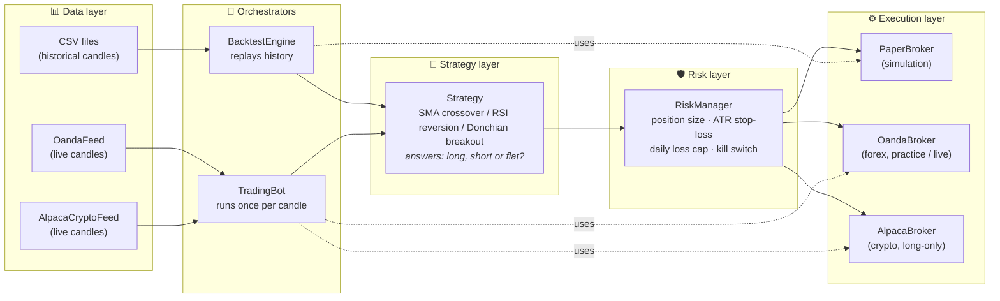
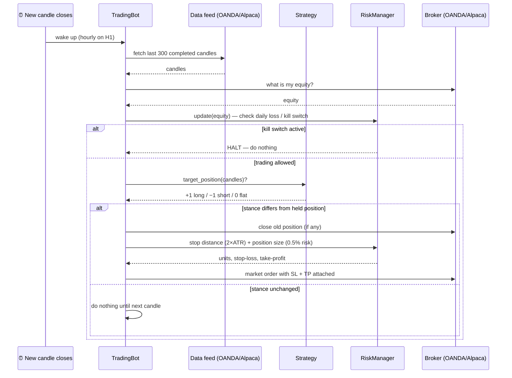

# forexbot — a trading bot built for learning first, trading second

A Python trading bot with a backtester, walk-forward validation, three
starter strategies, and a strict risk manager. Two brokers are supported:
**OANDA** (forex, free practice account) and **Alpaca** (crypto, free
paper account with no identity verification — a good fallback if OANDA
isn't available in your country).

> ## ⚠️ Read this before anything else
>
> **Most retail forex traders lose money.** Regulators require brokers to
> publish this: typically **70–80% of retail accounts lose**. No bot —
> including this one — can promise a weekly income.
>
> **The "$300/week" math.** A genuinely good strategy might return ~2% per
> month. To earn $300/week (~$1,300/month) at 2%/month you need roughly
> **$65,000 of capital**. Trying to squeeze $300/week out of a $1,000
> account requires ~130%/month, which forces extreme leverage — the fastest
> known way to lose the whole $1,000. Treat this project as a machine for
> *learning and testing ideas safely*, not as an income promise.
>
> **The built-in safety rails** (please don't remove them):
> - Everything defaults to **dry-run** (logs orders, sends nothing) on a
>   **practice** account (fake money).
> - Risk per trade is capped at 2% of equity — config values above that
>   are rejected.
> - A **daily loss limit** stops new trades after a bad day, and a
>   **drawdown kill switch** halts the bot entirely at −10% from peak.
> - Live trading refuses to start unless you *also* set
>   `FOREXBOT_I_UNDERSTAND_LIVE_RISK=yes` in your environment.
>
> **If you're trading crypto via Alpaca**: Alpaca cannot short crypto — the
> bot automatically clamps every SHORT signal to FLAT for this broker. That
> means a strategy's real crypto performance can be *meaningfully worse*
> than its forex backtest, which allowed shorting. Always pass `--long-only`
> when backtesting or walk-forwarding for this venue (see below) — never
> trust a number that let the strategy short if you can't actually short.
>
> Nothing here is financial advice.

---

## Architecture

The bot is a pipeline of five small, independent layers. Each layer only
talks to its neighbours, so you can swap any piece (a new strategy, a
different broker) without touching the rest.



### What each layer does

| Layer | Package | Job | Key idea |
|---|---|---|---|
| **Data** | `forexbot/data` | Deliver clean OHLC candles from CSV, OANDA, or Alpaca | Only *completed* candles are ever used — no trading on half-formed bars |
| **Strategy** | `forexbot/strategies` | Answer one question per candle: "do I want to be long (+1), short (−1) or flat (0)?" | Strategies are tiny and stateless-ish, so they're easy to test and swap |
| **Risk** | `forexbot/risk` | Decide *how much* to trade and *whether trading is allowed at all* | Direction comes from the strategy; survival comes from here |
| **Execution** | `forexbot/execution` | Place/close orders through a common `Broker` interface | The backtester's simulated broker and the real OANDA/Alpaca clients are interchangeable |
| **Orchestration** | `forexbot/backtest`, `forexbot/bot.py` | Wire the layers together: replay history (backtest) or run once per candle (live) | The live loop and the backtest loop follow the *same* per-candle sequence |

Alpaca crypto has two hard platform constraints the other layers accommodate
rather than hide: it **can't short** (a SHORT signal is clamped to FLAT — see
`long_only` on `BacktestEngine`/`PaperBroker`/`TradingBot`), and it **can't
bracket an order** (attach stop-loss + take-profit in one call, like OANDA
does). `AlpacaBroker` covers the gap with a resting stop-loss order (so
protection survives even if the bot's process dies) plus a take-profit level
tracked in memory and checked once per cycle — see the docstring in
`forexbot/execution/alpaca_broker.py` for the full reasoning.

### One trading cycle (what happens every hour on H1)



### How a trade is sized (the survival math)

```
risk_amount   = equity × 0.5%              e.g. $10,000 → $50
stop_distance = 2 × ATR(14)                e.g. 0.0030 (30 pips)
units         = risk_amount / stop_distance  →  16,666 units
```

If the stop-loss is hit, you lose ~$50 — an annoyance, not a disaster.
You would need ~20 consecutive losing trades to hit the daily/drawdown
brakes, and the bot stops itself long before the account is destroyed.

---

## Repository layout

```
forexbot/
├── data/            Candle type, CSV I/O, OANDA + Alpaca candle feeds
├── strategies/      base.py (interface) + sma_crossover, rsi_mean_reversion,
│                    donchian_breakout
├── risk/            RiskManager: sizing, stops, daily cap, kill switch
├── execution/       Broker interface, PaperBroker (sim), OandaBroker (forex),
│                    AlpacaBroker (crypto, long-only)
├── backtest/        BacktestEngine + metrics + walk-forward validation
├── indicators.py    SMA, EMA, RSI, ATR (pure Python, no dependencies)
├── config.py        YAML config loading (secrets come from the environment)
└── bot.py           The live/paper trading loop
scripts/
├── generate_sample_data.py   synthetic candles so backtests work offline
├── run_backtest.py           test a strategy on historical data (--long-only for Alpaca)
├── run_walkforward.py        the honest test: optimise on past, verify on unseen
├── download_data.py          fetch real history (--broker oanda|alpaca)
└── run_bot.py                start the (paper) trading bot
config/config.example.yaml           OANDA (forex) — copy to config/config.yaml and edit
config/config.example.crypto.yaml    Alpaca (crypto) — copy to config/config.yaml and edit
tests/                                63 unit tests: python -m unittest discover -s tests
```

---

## Quickstart

### 0. Requirements

Python 3.10+. Backtesting needs **no third-party packages at all**; live
trading needs two:

```bash
python3 -m venv .venv && source .venv/bin/activate
pip install -r requirements.txt
```

### 1. Run your first backtest (works immediately, offline)

```bash
python scripts/generate_sample_data.py    # creates data/sample_EURUSD_H1.csv (synthetic)
python scripts/run_backtest.py --data data/sample_EURUSD_H1.csv --strategy sma_crossover
```

You'll get a report like:

```
===== Backtest report =====
Starting balance :    10,000.00
Final equity     :     9,025.08
Net profit       :      -974.92  (-9.75%)
Trades           :          123
Win rate         :        32.5%
Max drawdown     :        10.0%
...
```

**Yes, the demo loses money — on purpose.** The bundled data is a random
walk, and random data has no pattern to exploit, so the spread slowly
bleeds the account until the −10% kill switch halts trading. This is the
single most important lesson in trading: *a bot only makes money if the
strategy has a real edge; the machinery cannot conjure one.* Your job is
to test ideas on **real data** until you find an edge — and to trust the
backtester when it tells you an idea doesn't work.

Try different strategies and parameters:

```bash
python scripts/run_backtest.py --data data/sample_EURUSD_H1.csv --strategy rsi_mean_reversion
python scripts/run_backtest.py --data data/sample_EURUSD_H1.csv --strategy donchian_breakout
python scripts/run_backtest.py --data data/sample_EURUSD_H1.csv --param fast=10 --param slow=100
```

### 1b. The honest test: walk-forward validation

A plain backtest answers "did these parameters work on this data?" — but you
*chose* the parameters by looking at that data, so of course they did. The
walk-forward runner simulates real life: it re-optimises on a rolling
training window, then trades the winner on the *next, unseen* window:

```bash
python scripts/run_walkforward.py --data data/EUR_USD_H1.csv \
    --strategy sma_crossover --grid fast=10,20,30 --grid slow=50,100,200
```

The report shows, fold by fold, what the optimiser picked, how good it
looked on the training data, and what it actually earned out-of-sample.
**A strategy only graduates to paper trading if the out-of-sample column
holds up.** Expect to discard most ideas here — every discard is money
saved.

### 2. Get real data (free OANDA practice account)

1. Go to [oanda.com](https://www.oanda.com/) and open a **demo/practice account** (free, no deposit).
2. In the dashboard, find **Manage API Access** and generate a token.
3. Note your practice **account ID** (looks like `101-XXX-XXXXXXX-XXX`).

```bash
export OANDA_API_TOKEN="paste-your-token-here"
python scripts/download_data.py --broker oanda --instrument EUR_USD --granularity H1 --days 730
python scripts/run_backtest.py --data data/EUR_USD_H1.csv --strategy sma_crossover
```

### 2b. No OANDA? Trade crypto via Alpaca instead

OANDA isn't available in every country. **Alpaca** is a solid fallback:
signup is just email + password, with no identity verification required
for paper trading.

1. Sign up free at [alpaca.markets](https://alpaca.markets/) and generate
   API keys from the dashboard (no ID upload needed for paper trading).
2. Download real crypto history and backtest it **with `--long-only`**
   (Alpaca can't short crypto, so an honest number has to reflect that):

```bash
export ALPACA_API_KEY_ID="paste-your-key-id-here"
export ALPACA_API_SECRET_KEY="paste-your-secret-key-here"
python scripts/download_data.py --broker alpaca --instrument BTC/USD --granularity 1Hour --days 730
python scripts/run_backtest.py --data data/BTCUSD_1Hour.csv --strategy sma_crossover --long-only
python scripts/run_walkforward.py --data data/BTCUSD_1Hour.csv \
    --strategy sma_crossover --grid fast=10,20,30 --grid slow=50,100,200 --long-only
```

Skip straight to step 3 below, using `config/config.example.crypto.yaml`
instead of the OANDA one.

### 3. Paper trade (fake money, real market)

```bash
# OANDA (forex):
cp config/config.example.yaml config/config.yaml
# edit config/config.yaml: set your oanda.account_id
export OANDA_API_TOKEN="paste-your-token-here"
python scripts/run_bot.py

# Alpaca (crypto):
cp config/config.example.crypto.yaml config/config.yaml
export ALPACA_API_KEY_ID="paste-your-key-id-here"
export ALPACA_API_SECRET_KEY="paste-your-secret-key-here"
python scripts/run_bot.py
```

With the default `dry_run: true` the bot only *logs* what it would do —
watch it for a few days. When the decisions make sense to you, set
`dry_run: false` and it will trade the practice account for real
(still fake/paper money).

### 4. Live trading — much later

Do not even think about this until you have:

- [ ] months of profitable **paper** results (not backtests — paper),
- [ ] read every line of `forexbot/risk/manager.py` and understood it,
- [ ] money you can afford to lose completely,
- [ ] realistic expectations (see the warning at the top).

Then: `mode: live` in the config **and** `FOREXBOT_I_UNDERSTAND_LIVE_RISK=yes`
in the environment. The bot refuses to start live without both.

---

## Extending the bot

**Add a strategy** — subclass `Strategy`, return +1/−1/0, register it:

```python
# forexbot/strategies/my_strategy.py
from .base import Strategy, LONG, SHORT, FLAT

class MyStrategy(Strategy):
    warmup = 50

    def target_position(self, candles):
        # your idea here
        return FLAT
```

then add it to `STRATEGIES` in `forexbot/strategies/__init__.py` and it is
immediately available to both the backtester and the live bot:

```bash
python scripts/run_backtest.py --data data/EUR_USD_H1.csv --strategy my_strategy
```

**Roadmap ideas** (roughly in order of value):

1. Multi-pair/multi-asset support (e.g. EUR_USD + GBP_USD, or BTC/USD +
   ETH/USD) with a portfolio-level risk budget.
2. Trade journal: log every decision with the indicator values that caused
   it, so losing streaks can be diagnosed.
3. Notifications (email/Telegram) when the kill switch fires or a trade opens.
4. Session filters (skip low-liquidity hours around the New York close /
   weekend gaps — forex only, crypto trades 24/7).

## Glossary (the terms this README uses)

| Term | Meaning |
|---|---|
| **Candle / OHLC** | Price summary of one interval: Open, High, Low, Close |
| **Pip** | Smallest conventional price step; 0.0001 for EUR/USD |
| **Spread** | Gap between buy and sell price — the cost you pay every trade |
| **Long / short** | Betting the price rises / falls |
| **Stop-loss (SL)** | Order that closes a losing trade automatically at a set price |
| **Take-profit (TP)** | Order that banks a winning trade automatically |
| **ATR** | Average True Range — how much price typically moves per candle |
| **Drawdown** | How far equity has fallen from its peak |
| **Sharpe ratio** | Return per unit of risk; > 1 is decent, > 2 is very good |
| **Paper trading** | Trading with fake money to test safely |

## Running the tests

```bash
python -m unittest discover -s tests -v
```
